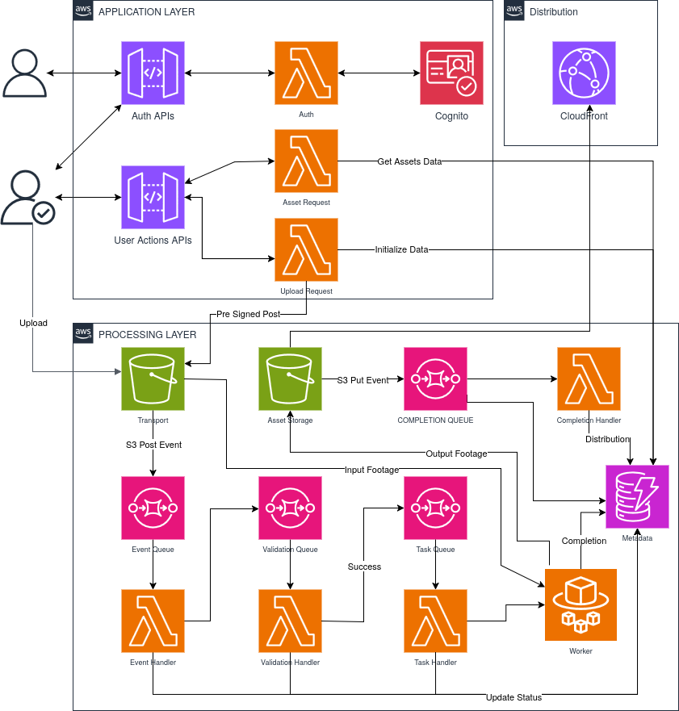

# ShortRelay
ShortRelay is a serverless video processing pipeline built on AWS. It uses event-driven architecture and loosely coupled components to reliably and efficiently process and distribute short-form videos.

Tech Stack:
- Built entirely on AWS using CI/CD with CodePipeline and CloudFormation ([CI/CD Details](./infrastructure/README.md))
- Backend components (Lambdas) use TypeScript, Node.js, and AWS SDK v3
- Workers are built with Go, utilizing FFmpeg, FFprobe, and AWS SDK v2
- Frontend is developed using Next.js

# Pipeline

## APIs
### Auth APIs
The Auth APIs include the following endpoints for managing user authentication and identity:

- `POST /v1/auth/signup`: Allows a new user to create an account by providing their details. The IdentityHandler Lambda function processes this request and creates the user in the Cognito user pool.

- `POST /v1/auth/signin`: Authenticates an existing user by verifying their credentials. The IdentityHandler Lambda checks the provided username and password against the Cognito user pool. If valid, it returns an access token the user can include in subsequent requests to identify themselves.

- `POST /v1/auth/signout`: Logs out the currently authenticated user by invalidating their access token. The IdentityHandler updates the user's session in Cognito to reflect the logout.

- `POST /v1/auth/forgot-password`: Allows a user to reset their password if they've forgotten it. The IdentityHandler initiates the password reset flow in Cognito, which typically involves sending the user a verification code they can use to set a new password.

- `POST /v1/auth/forgot-password/confirm`: The IdentityHandler would validate the code and allow the user to set a new password.

- `POST /v1/auth/session/refresh`: Refreshes the user's access token if it has expired. The IdentityHandler checks the refresh token in `Auth Cache`, and if valid, generates a new access token so the user can continue making authenticated requests.

All these endpoints integrate with the Cognito user pool, which serves as the central identity store for the application. Cognito handles the details of securely storing user credentials, managing sessions, and generating access tokens.

### User Actions APIs  

The User Actions APIs allow authenticated users to interact with the system. Key endpoints include:
- `POST /v1/user/upload-request` to request an upload URL for submitting data
- `GET /v1/user/assets/all` to retrieve a list of all the user's assets
- `GET /v1/user/assets/{assetId}` to get details on a specific asset
- `GET /v1/user/assets/progress` to check the progress of an asset upload or processing job

## Request Handlers

The Request Handlers are Lambda functions that process the API requests. There are three main handlers:

1. `IdentityHandler` - Handles the authentication flows by integrating with the Cognito user pool & Auth Cache. It processes the `/auth` API requests.

2. `UploadHandler` - Manages data uploads. When a user makes an `/upload-request`, the UploadHandler provides a pre-signed-POST S3 URL that the user can POST their data to. This uploads the data into the `Transport` S3 bucket.

3. `ContentRequestHandler` - Retrieves data about the user's uploaded content. It fetches lists of assets or specific asset details from the `Metadata Storage Table`.

## Object Storage

### ContentStorage (S3 bucket)
The `ContentStorage` S3 bucket contains the processed data. After Processing is Done, this bucket is responsible for sending completions events notifications to `Completion Handler` and also acts as an Origin to `Cloud Front`.

### TransportStorage (S3 bucket)  
The `TransportStorage` S3 bucket contains the raw footage uploaded by users. S3 bucket is used as temporary holding place when data needs to be passed between different parts of the system. For example, when a file finishes uploading, an event might put a message here to trigger the next processing step using event notifications.

## Upload Event
1. User uploads a raw video file to the `TransportStorage` S3 bucket using pre-signed-post url provided by `Upload Handler`.
2. S3 PutObject event triggers an `Event Notification: POST` to the `UploadQueue` SQS queue
3. `UploadQueue` receives a message with the S3 object info (bucket, key)

## Validation
1. `EventHandler` Lambda polls the `UploadQueue` for new messages
2. Upon receiving a message, `EventHandler`:
    - Extracts S3 object info from the message
    - Creates a validation task with the S3 info
    - Sends the validation task to the `ValidationQueue` SQS queue
3. `ValidationHandler` Lambda consumes messages from `ValidationQueue`
4. For each validation task, `ValidationHandler`:
    - Downloads the video file from `TransportStorage` using the S3 info
    - Validates the video file format and requirements
    - Extracts video metadata (duration, resolution, codec, etc.)
    - If validation succeeds:
        - Creates a video processing task with the metadata
        - Sends the processing task to the `TaskQueue` SQS queue

## Task Execution Pipeline
1. **Task Queuing**: 
   * Tasks are added to the `TaskQueue` SQS queue. 
   * This queue acts as a buffer, holding tasks until they're ready to be processed.
2. **Task Handler**:
   * The `TaskHandler` Lambda function polls batch of task from `TaskQueue`.
   * Check Current State of workers and Assigns transcoding jobs to Fargate worker based on availability.
3. **Workers**:
   * When Assigned a batch job, Worker sequentially transcodes and uploads footage to `Content Storage`.
   * Worker also updates status of each step in `Metadata Storage`.
   * It also uploads a special file `completion.json' which is used by Completion Handler to do Post Processing Validation.
4. **Error Handling with Dead Letter Queue**:
   * If a task in the `TaskQueue` fails to be processed for any reason, it's sent to the `TaskDLQ`.
   * The DLQ acts as a safety net, preventing failed tasks from being lost or blocking the main queue.
   * The `TaskDLQHandler` Lambda is responsible for handling these failed tasks.

## Completion Event
1. Processed footage is uploaded to `Content Storage` by Fargate Worker.
2. S3 PutObject event triggers an special `Event Notification:PUT` with suffix `completion.json` to the `CompletionQueue` SQS queue
3. `CompletionHandler` Lambda consumes messages from `CompletionQueue` 
4. For each completed video, `CompletionHandler`:
    - Validates the processed video
    - Generates CDN links for streaming/download

## Metadata Storage
- `Metadata Storage Table` (DynamoDB) stores video metadata throughout the process
- Metadata includes: video name, S3 location, processing status, CDN links
- Allows quick lookup of video details without scanning S3

## Dead Letter Queues (DLQs)
- Each main SQS queue has a corresponding DLQ
- Messages are moved to DLQ after repeated processing failures
- Prevents queue blockage by problematic messages
- DLQ Handler Lambdas are triggered by DLQ messages for error handling/alerts
