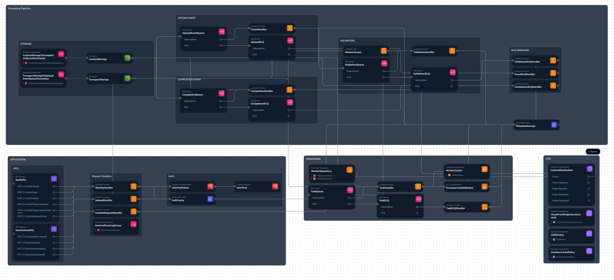

# ShortRelay Backend

This project implements a serverless architecture for short video transcoding and delivery using AWS services, defined with the AWS Serverless Application Model (SAM).
### [Cloud Formation Templte used in Continuous Deployment](./infrastructure/docs/backend.yml)
### [CodePipeline created by AWS](./infrastructure/docs/pipeline.png)

## Overview

Users upload videos which are processed and transcoded using serverless compute. Transcoded videos are stored and delivered via a CDN. The architecture uses Lambda, API Gateway, S3, SQS, ECS, DynamoDB, Cognito, and CloudFront.

## Globals

Globals define common settings for resources of the same type.

### Lambda Function Globals
- `PermissionsBoundary`: Restricts Lambda permissions
- Environment variables for Cognito, S3, CORS, FFmpeg
- `LoggingConfig`: CloudWatch logging with WARN level, JSON format
- `Application` and `Environment` tags

### API Gateway Globals 
- `EndpointConfiguration`: REGIONAL endpoint type
- X-Ray tracing enabled
- CORS configuration for allowed origin, headers, methods, preflight max age
- `MethodSettings`: ERROR level logging, data tracing

## Parameters

Template parameters allow deployment customization:

- `AppId`: Unique application identifier
- `UploadSizeLimit`, `UploadTimeLimit`: Max size and time for uploads
- `TransportExpiryDays`, `ContentExpiryDays`: File expiration in S3 buckets
- `AllowedOrigin`: Allowed CORS origin
- `AesKeyUtil`: AES encryption key
- `DefaultVpcId`, `DefaultSubnetIds`, `DefaultSecurityGroupId`: Network config for ECS
- `FargateTaskLimit`: Max concurrent Fargate tasks
- `CompletionTrigger`: S3 event suffix for `CompletionQueue` trigger
- `Environment`: Deployment environment (Development, Staging, Production)

## Authentication & Authorization

Cognito user pool for authentication:
- Email-based signup and login, password policies, access/ID/refresh tokens

Cognito user pool client:
- Password-based auth flow, token validity config

## API Gateway

### AuthAPIs
Authentication endpoints:
- `/v1/auth/signup`, `/v1/auth/login`, `/v1/auth/logout`, `/v1/auth/forget-password`, `/v1/auth/session/refresh`

### UserActionsAPIs
User actions endpoints:  
- `/v1/user/upload-request`, `/v1/user/assets/all`, `/v1/user/asset/{assetId}`, `/v1/user/assets/progress`

## Lambda Functions

- `IdentityHandler`: User authentication 
- `UploadHandler`: Upload requests, pre-signed S3 URLs  
- `EventHandler`: S3 upload events, validation trigger
- `TaskHandler`: Fargate transcoding task management
- `CompletionHandler`: Post-transcoding processing
- `ValidationHandler`: Video validation
- `ContentRequestHandler`: User asset retrieval
- `*DLQHandler`: Dead-letter queue processing

## Storage

- `TransportStorage`: Temp S3 upload bucket with CORS and lifecycle rules
- `ContentStorage`: Transcoded video S3 bucket with lifecycle rules, CloudFront
- `MetadataStorage`: DynamoDB video metadata table with composite key
- `AuthCache`: DynamoDB auth data cache with `userId` key

## Queues

SQS for event-driven processing:

- `UploadEventQueue`: S3 upload events, `EventHandler` invocation, DLQ
- `ValidationQueue`: `ValidationHandler` tasks, DLQ
- `TaskQueue`: `TaskHandler` transcoding tasks, DLQ
- `CompletionQueue`: `CompletionHandler` post-transcoding tasks, S3 trigger, DLQ

## Compute

- `WorkerCluster`: ECS cluster for Fargate transcoding, supports Fargate Spot  
- `ProcessorTaskDefinition`: Transcoding task definition, ARM64, env var config

## Content Delivery

- `ContentDistribution`: CloudFront CDN for transcoded videos
  - `CloudFrontOriginAccessControl` restricts S3 origin
  - `CORSPolicy` for allowed origins
  - `CachePolicy` for 1h content caching
